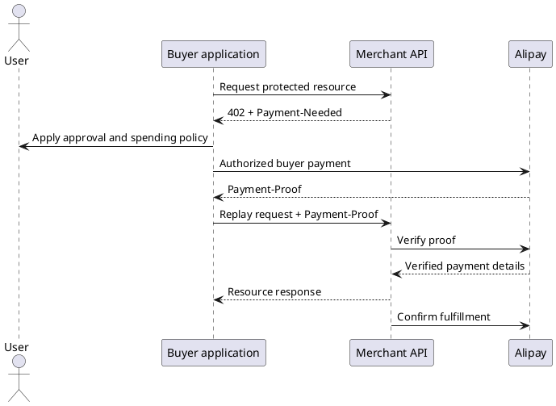

# Build Alipay AI Pay with Avery SDK

Alipay AI Pay is a 402-based A2M payment flow for APIs, digital content, and
compute resources. A merchant returns a signed `Payment-Needed` challenge; a
buyer application obtains a `Payment-Proof`; the merchant verifies it through
Alipay before delivering the resource and confirming fulfillment.

This guide shows both sides of the protocol with `@averyso/alpha`:

- **Merchant inbound**: protect a resource, verify the proof, prevent replay,
  and confirm fulfillment.
- **Buyer outbound Machine Pay**: make a normal Fetch API request, delegate one
  eligible challenge to an application-owned payer, and retry once.

These are separate roles. Merchant credentials cannot create a buyer proof, and
the SDK intentionally does not turn one into the other.

## Prerequisites

- Node.js `>=20.19.0` and `@averyso/alpha` installed.
- An Alipay AI Pay merchant application, service ID, seller ID, and production
  gateway credentials for the inbound side.
- A durable, atomic replay store for an inbound production deployment.
- An authorized buyer payment capability for outbound Machine Pay. It must
  enforce the application's merchant trust, user approval, and spending policy.

```sh
pnpm add @averyso/alpha
```

Keep all keys and payment material on the server. Do not log `Payment-Needed`,
`Payment-Proof`, private keys, signatures, or raw gateway payloads.

## Payment Lifecycle



The resource server must treat the `Payment-Proof` as untrusted input until the
gateway verification result is active and matches the current order, amount,
and resource. The buyer must treat every `Payment-Needed` as untrusted until
its own policy permits the payment.

## Merchant Inbound Runtime

`createAlphaPayment()` is the recommended merchant integration. It keeps the
payment sequence together: issue the 402 challenge, parse and verify the proof,
claim replay protection, buffer the response, confirm fulfillment, then release
the resource response.

```ts
import { createAlphaPayment } from "@averyso/alpha";
import type { AlphaReplayStore } from "@averyso/alpha";

import { getOrCreateOrder } from "./orders.js";
import { replayStore } from "./replay-store.js";

export const payment = createAlphaPayment({
  provider: "alipay",
  direction: "inbound",
  client: {
    appId: process.env.ALIPAY_APP_ID!,
    privateKey: process.env.ALIPAY_APP_PRIVATE_KEY!,
    alipayPublicKey: process.env.ALIPAY_PUBLIC_KEY!,
  },
  replayStore: replayStore satisfies AlphaReplayStore,
  routes: {
    "POST /api/reports": {
      bill: async ({ request }) => {
        const order = await getOrCreateOrder({
          idempotencyKey: request.headers.get("idempotency-key"),
          resourceId: "/api/reports",
        });

        return {
          outTradeNo: order.outTradeNo,
          amount: order.amount,
          resourceId: order.resourceId,
          payBefore: order.payBefore,
          sellerId: process.env.ALIPAY_SELLER_ID!,
          sellerName: "Example Seller",
          goodsName: "AI report",
          serviceId: process.env.ALIPAY_SERVICE_ID!,
        };
      },
      maxResponseBytes: 1024 * 1024,
    },
  },
});
```

`getOrCreateOrder()` must be idempotent. The runtime evaluates a route's bill
for both the challenge request and the proof retry, so the same logical request
must resolve to the same order number, amount, resource ID, and expiry.

`alipayPublicKey` is optional in the TypeScript type for local development, but
it is required in production. Without it, the merchant cannot verify Alipay's
gateway response signature.

### Bind a Route Handler

Alipay inbound must use an Alpha wrapper. It prevents a resource response from
being committed before fulfillment confirmation succeeds.

```ts
// app/api/reports/route.ts
import { withAlphaNext } from "@averyso/alpha/next";

import { payment } from "@/server/payment";
import { buildReport } from "@/server/reports";

export const runtime = "nodejs";

export const POST = withAlphaNext(payment, async (request, context) => {
  if (context.provider !== "alipay" || context.direction !== "inbound") {
    throw new Error("Expected an Alipay inbound payment context.");
  }

  return Response.json({
    report: await buildReport(request.signal),
    tradeNo: context.payment?.tradeNo,
  });
});
```

For Express and Hono, use `withAlphaExpress()` and `withAlphaHono()` for the
same reason. Ordinary `alphaExpressMiddleware()` and `alphaHonoMiddleware()`
intentionally reject Alipay inbound runtimes.

### Inbound State Machine

| Request condition                                       | Avery SDK behavior                                                         |
| ------------------------------------------------------- | -------------------------------------------------------------------------- |
| No `Payment-Proof`                                      | Return `402 Payment Required` with a signed `Payment-Needed`.              |
| Invalid or inactive proof                               | Return a fresh 402 challenge.                                              |
| Active proof with mismatched amount, order, or resource | Return a fresh 402 challenge.                                              |
| Duplicate or in-progress trade                          | Stop before resource delivery through the replay store.                    |
| Verified proof                                          | Run the handler, buffer the response, confirm fulfillment, then return it. |

The replay store's `claim()` operation must be atomic across application
workers. Use Redis, a database, or another durable compare-and-set system; an
in-memory map is not safe across restarts or multiple workers.

## Buyer Outbound Machine Pay

`AlipayAIPayMachinePayClient` is a raw Fetch API client. It does not parse the
bill, generate a proof, call a merchant gateway endpoint, or return an x402
`EndpointResult`. It always returns the raw `Response`.

```ts
import { AlipayAIPayMachinePayClient } from "@averyso/alpha";

const client = new AlipayAIPayMachinePayClient({
  payer: {
    async createPaymentProof({ paymentNeeded, request, signal }) {
      return buyerPaymentPolicy.authorize({
        paymentNeeded,
        request,
        signal,
      });
    },
  },
});

const response = await client.fetch("https://merchant.example.test/api/reports", {
  method: "POST",
  headers: {
    "content-type": "application/json",
    "idempotency-key": crypto.randomUUID(),
  },
  body: JSON.stringify({ topic: "payment operations" }),
});

if (!response.ok) {
  // Inspect status and a safe response body according to application policy.
}
```

The required `payer` is an application boundary, not a convenience callback.
It must validate the merchant and amount represented by the challenge, apply
user approval and spending limits, then obtain and return exactly one
`paymentProofHeader` from an authorized buyer payment capability.

Do not pass merchant `appId`, RSA private keys, or the merchant gateway client
to this payer. Those credentials identify the seller and cannot safely create a
buyer proof. Avery SDK has no default payer and does not run an Alipay CLI.

### Outbound Request Rules

`client.fetch(input, init?)` supports normal Fetch API request forms and has a
fixed, non-recursive state machine:

1. Send the original request.
2. Return a non-402 response unchanged.
3. Return a 402 unchanged when `Payment-Needed` is missing or blank.
4. Return a 402 unchanged when the original request already has
   `Payment-Proof`; the SDK will not overwrite it.
5. For one eligible 402, call `payer.createPaymentProof()` with the exact
   challenge header, request URL, method, and effective abort signal.
6. Retry once with the non-empty proof returned by the payer.
7. Return the second response unchanged, including a second 402.

The request body, method, ordinary headers, and abort signal are preserved for
the retry. Request construction, payer, and retry failures surface as
`AlipayAIPayRequestError` without payment header values in the error message or
SDK logs.

### Use Machine Pay Through a Runtime

Use an outbound runtime when an application framework should inject the client
into route context:

```ts
import { createAlphaPayment } from "@averyso/alpha";
import { withAlphaNext } from "@averyso/alpha/next";

const payment = createAlphaPayment({
  provider: "alipay",
  direction: "outbound",
  client: {
    payer: {
      createPaymentProof: (input) => buyerPaymentPolicy.authorize(input),
    },
  },
});

export const GET = withAlphaNext(payment, async (_request, context) => {
  if (context.provider !== "alipay" || context.direction !== "outbound") {
    throw new Error("Expected an Alipay outbound payment context.");
  }

  const response = await context.client.fetch("https://merchant.example.test/api/reports");
  return Response.json({ status: response.status });
});
```

Alipay outbound works with ordinary Express and Hono middleware because it only
injects a reusable client. `alphaNextProxy()` remains limited to x402 inbound
runtimes and cannot run an Alipay payment flow.

## Production Checklist

- Configure `alipayPublicKey` for inbound gateway-response verification.
- Use a stable order reservation and atomic replay store for inbound requests.
- Keep the merchant private key, buyer authorization capability, and payment
  material server-side.
- Make buyer merchant allowlists, payment limits, and approval requirements
  explicit in the injected payer.
- Treat a fulfillment-confirmation failure as uncertain payment state; reconcile
  the trade before retrying or delivering again.
- Exclude payment headers, signatures, private keys, and raw gateway responses
  from logs, traces, error reporting, and analytics.

## Troubleshooting

| Symptom                               | Check                                                                                                                  |
| ------------------------------------- | ---------------------------------------------------------------------------------------------------------------------- |
| Merchant always returns 402           | Verify route matching, bill fields, `Payment-Proof` parsing, and gateway verification expectations.                    |
| Verified proof still cannot deliver   | Check replay-store claim status and fulfillment confirmation errors.                                                   |
| Outbound payer is never called        | The response was not an eligible 402: inspect only the status and presence of `Payment-Needed`, not its value in logs. |
| Outbound request returns a second 402 | This is final by design. Do not auto-pay again; reconcile with the buyer policy or merchant.                           |
| Gateway response cannot be trusted    | Configure the current Alipay public key and verify its rotation process.                                               |

For protocol details and merchant onboarding, consult the [Alipay AI Pay product
integration guide](https://aipay.alipay.com/docs/ai-receive/MACHINE_PAY.html).
For every Avery SDK type and option, see the [SDK API reference](/api/sdk) and
[payment middleware guide](/guide/payment-middleware).
