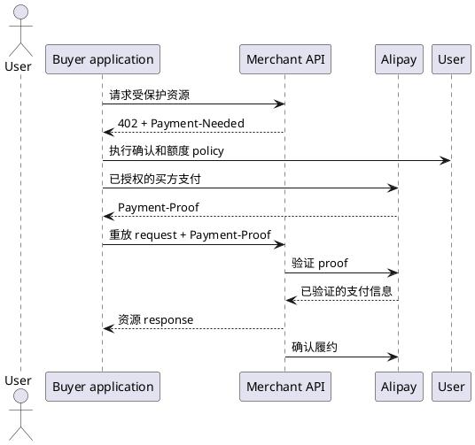

# 使用 Avery SDK 集成支付宝 AI 支付

支付宝 AI Pay 是基于 402 的 A2M 支付流程，适用于 API、数字内容和算力资源。商家
返回带签名的 `Payment-Needed` challenge，买方应用取得 `Payment-Proof`，商家在交付
资源前通过支付宝验证凭证，并在交付后确认履约。

本指南展示如何用 `@averyso/alpha` 实现协议两端：

- **商家 inbound**：保护资源、验证 proof、防重放并确认履约。
- **买方 outbound Machine Pay**：发送标准 Fetch API request，将一次合格 challenge
  交给应用自己的 payer，并仅重试一次。

这两个角色必须严格分离。商家凭据不能生成买方 proof，SDK 也不会把两者混用。

## 前置条件

- Node.js `>=20.19.0`，且已安装 `@averyso/alpha`。
- inbound 侧需要支付宝 AI Pay 商家应用、service ID、seller ID 和生产 gateway 凭据。
- inbound 生产部署需要 durable、atomic replay store。
- outbound Machine Pay 需要已授权的买方支付能力，并由它执行商户可信校验、用户确认
  与额度 policy。

```sh
pnpm add @averyso/alpha
```

所有密钥和 payment material 必须留在服务端。不要记录 `Payment-Needed`、
`Payment-Proof`、私钥、签名或 raw gateway payload。

## 支付生命周期



resource server 必须将 `Payment-Proof` 视为不可信 input，直至网关返回 active 且其
order、amount、resource 都与当前账单匹配。买方也必须将每个 `Payment-Needed` 视为
不可信 input，直至自己的 policy 明确允许付款。

## 商家 Inbound Runtime

推荐使用 `createAlphaPayment()` 集成商家侧。它会串联完整顺序：发出 402 challenge、
解析并验证 proof、claim replay protection、buffer response、确认履约，最后才返回
资源 response。

```ts
import { createAlphaPayment } from "@averyso/alpha";
import type { AlphaReplayStore } from "@averyso/alpha";

import { getOrCreateOrder } from "./orders.js";
import { replayStore } from "./replay-store.js";

export const payment = createAlphaPayment({
  provider: "alipay",
  direction: "inbound",
  client: {
    appId: process.env.ALIPAY_APP_ID!,
    privateKey: process.env.ALIPAY_APP_PRIVATE_KEY!,
    alipayPublicKey: process.env.ALIPAY_PUBLIC_KEY!,
  },
  replayStore: replayStore satisfies AlphaReplayStore,
  routes: {
    "POST /api/reports": {
      bill: async ({ request }) => {
        const order = await getOrCreateOrder({
          idempotencyKey: request.headers.get("idempotency-key"),
          resourceId: "/api/reports",
        });

        return {
          outTradeNo: order.outTradeNo,
          amount: order.amount,
          resourceId: order.resourceId,
          payBefore: order.payBefore,
          sellerId: process.env.ALIPAY_SELLER_ID!,
          sellerName: "Example Seller",
          goodsName: "AI report",
          serviceId: process.env.ALIPAY_SERVICE_ID!,
        };
      },
      maxResponseBytes: 1024 * 1024,
    },
  },
});
```

`getOrCreateOrder()` 必须幂等。runtime 会在 challenge request 和 proof retry 中各计算
一次 bill，因此同一个逻辑 request 必须得到相同的 order number、amount、resource ID
和 expiry。

`alipayPublicKey` 在 TypeScript type 中可选，便于本地开发；但生产环境必须配置。
否则商家无法验证支付宝 gateway response 的签名。

### 绑定 Route Handler

Alipay inbound 必须使用 Alpha wrapper，确保资源 response 不会在履约确认成功前提交。

```ts
// app/api/reports/route.ts
import { withAlphaNext } from "@averyso/alpha/next";

import { payment } from "@/server/payment";
import { buildReport } from "@/server/reports";

export const runtime = "nodejs";

export const POST = withAlphaNext(payment, async (request, context) => {
  if (context.provider !== "alipay" || context.direction !== "inbound") {
    throw new Error("Expected an Alipay inbound payment context.");
  }

  return Response.json({
    report: await buildReport(request.signal),
    tradeNo: context.payment?.tradeNo,
  });
});
```

在 Express 和 Hono 中，分别使用 `withAlphaExpress()` 和 `withAlphaHono()`。普通
`alphaExpressMiddleware()` 与 `alphaHonoMiddleware()` 会有意拒绝 Alipay inbound
runtime。

### Inbound State Machine

| Request 条件                                     | Avery SDK 行为                                          |
| ------------------------------------------------ | ------------------------------------------------------- |
| 缺少 `Payment-Proof`                             | 返回带签名 `Payment-Needed` 的 `402 Payment Required`。 |
| proof 无效或不 active                            | 返回新的 402 challenge。                                |
| active proof 的 amount、order 或 resource 不匹配 | 返回新的 402 challenge。                                |
| trade 重复或进行中                               | 通过 replay store 在资源交付前停止。                    |
| proof 已验证                                     | 运行 handler、buffer response、确认履约，然后才返回。   |

replay store 的 `claim()` 必须能在所有应用 worker 间原子执行。应使用 Redis、数据库
或其他 durable compare-and-set 系统；进程内 map 无法抵御重启和多 worker。

## 买方 Outbound Machine Pay

`AlipayAIPayMachinePayClient` 是 raw Fetch API client。它不会解析 bill、生成 proof、
调用商家 gateway endpoint，也不会返回 x402 的 `EndpointResult`。它始终返回原始
`Response`。

```ts
import { AlipayAIPayMachinePayClient } from "@averyso/alpha";

const client = new AlipayAIPayMachinePayClient({
  payer: {
    async createPaymentProof({ paymentNeeded, request, signal }) {
      return buyerPaymentPolicy.authorize({
        paymentNeeded,
        request,
        signal,
      });
    },
  },
});

const response = await client.fetch("https://merchant.example.test/api/reports", {
  method: "POST",
  headers: {
    "content-type": "application/json",
    "idempotency-key": crypto.randomUUID(),
  },
  body: JSON.stringify({ topic: "payment operations" }),
});

if (!response.ok) {
  // Inspect status and a safe response body according to application policy.
}
```

必填的 `payer` 是应用的 security boundary，不是简单的 callback。它必须校验
challenge 中代表的商户与金额，执行用户确认和额度限制，然后通过已授权的买方支付
能力取得并返回唯一的 `paymentProofHeader`。

不要将商户 `appId`、RSA 私钥或商家 gateway client 传给这个 payer。这些凭据只标识
seller，不能安全地创建 buyer proof。Avery SDK 没有默认 payer，也不会运行支付宝 CLI。

### Outbound Request 规则

`client.fetch(input, init?)` 支持标准 Fetch API request form，并使用固定、非递归的
state machine：

1. 发送原始 request。
2. 非 402 response 原样返回。
3. `Payment-Needed` 缺失或为空的 402 原样返回。
4. 原始 request 已有 `Payment-Proof` 时，402 原样返回，SDK 不会覆盖它。
5. 对一个合格的 402，将原始 challenge header、request URL、method 和有效
   abort signal 传给 `payer.createPaymentProof()`。
6. 使用 payer 返回的非空 proof 仅重试一次。
7. 第二个 response 原样返回，即使它仍然是 402。

request body、method、普通 headers 和 abort signal 都会为这一次 retry 保持。request
构造、payer 和 retry failure 会抛出 `AlipayAIPayRequestError`，error message 和 SDK
日志不会包含 payment header 值。

### 通过 Runtime 使用 Machine Pay

当应用 framework 需要将 client 注入 route context 时，使用 outbound runtime：

```ts
import { createAlphaPayment } from "@averyso/alpha";
import { withAlphaNext } from "@averyso/alpha/next";

const payment = createAlphaPayment({
  provider: "alipay",
  direction: "outbound",
  client: {
    payer: {
      createPaymentProof: (input) => buyerPaymentPolicy.authorize(input),
    },
  },
});

export const GET = withAlphaNext(payment, async (_request, context) => {
  if (context.provider !== "alipay" || context.direction !== "outbound") {
    throw new Error("Expected an Alipay outbound payment context.");
  }

  const response = await context.client.fetch("https://merchant.example.test/api/reports");
  return Response.json({ status: response.status });
});
```

Alipay outbound 可以使用普通 Express/Hono middleware，因为它只注入可复用 client。
`alphaNextProxy()` 仍只支持 x402 inbound runtime，不能用于 Alipay 支付流程。

## 生产检查清单

- 为 inbound gateway response verification 配置 `alipayPublicKey`。
- 为 inbound request 使用稳定的 order reservation 和 atomic replay store。
- 商家私钥、买方授权能力和 payment material 都只放在服务端。
- 在注入的 payer 中明确实现 merchant allowlist、payment limit 和 approval policy。
- 将 fulfillment confirmation failure 视为不确定支付状态；在 retry 或再次交付前完成
  trade reconciliation。
- 从 logs、traces、error reporting 和 analytics 中排除 payment headers、签名、私钥和
  raw gateway response。

## 故障排查

| 现象                            | 检查项                                                                                        |
| ------------------------------- | --------------------------------------------------------------------------------------------- |
| 商家始终返回 402                | 检查 route match、bill fields、`Payment-Proof` parse 和 gateway verification expectation。    |
| proof 已验证但仍无法交付        | 检查 replay-store claim status 和 fulfillment confirmation error。                            |
| outbound payer 从未调用         | response 不是合格的 402。只检查 status 与 `Payment-Needed` 是否存在，不要在日志输出其值。     |
| outbound request 得到第二个 402 | 这是有意设计的最终结果。不要自动再次付款，应与 buyer policy 或 merchant 进行 reconciliation。 |
| gateway response 无法信任       | 配置当前的 Alipay public key，并建立 key rotation 流程。                                      |

协议细节和商家入驻请参考[支付宝 AI Pay 产品接入指南](https://aipay.alipay.com/docs/ai-receive/MACHINE_PAY.html)。
所有 Avery SDK type 与 option 请参考 [SDK API 参考](/zh/api/sdk) 和
[支付 Middleware 指南](/zh/guide/payment-middleware)。
